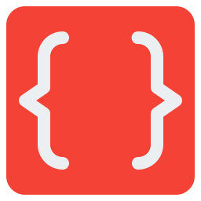

# <p> GAA dotnet code analysis</p>

Набор правил для анализа .Net кода.

## Перечень технологий

StyleCop.Analyzers, Microsoft.CodeAnalysis.

## [История изменения](CHANGELOG.md)

## Основная информация о пакете

Библиотека использует [Microsoft.CodeAnalysis](https://www.nuget.org/packages/Microsoft.CodeAnalysis)

Общая информация может быть найдена
тут [Code Analysis](https://docs.microsoft.com/en-us/dotnet/fundamentals/code-analysis/overview)

## Использование

Для того чтобы анализатор кода работал корректно обновите
ваш [.editorconfig](http://git.esphere.local/templates/projects/-/blob/master/content/solution/.editorconfig) теперь в
нем должны содержаться так же параметры статических анализаторов. Пример:

```yaml
# Microsoft .NET properties

dotnet_style_predefined_type_for_member_access=true:suggestion
dotnet_style_qualification_for_event=false:suggestion
dotnet_style_qualification_for_field=false:suggestion
dotnet_style_qualification_for_method=false:suggestion
dotnet_style_qualification_for_property=false:suggestion
```

## Отключение правил

Все правила включены по умолчанию, для отключения правил требуется прописать в .editorconfig:

```yaml
dotnet_diagnostic.CA1801.severity = none
```

Прочие настройки уровней можно
найти [тут](https://docs.microsoft.com/en-us/visualstudio/code-quality/use-roslyn-analyzers?view=vs-2019)

## Этапы сборки проекта

- Изменяем версию проекта в файде `Gaa.DotNet.CodeAnalysis.nuspec`;
- Скачиваем и устанавливаем [nuget.exe](https://www.nuget.org/downloads);
- Находясь в директории проекта вводим команду в терминал `nuget.exe pack`;